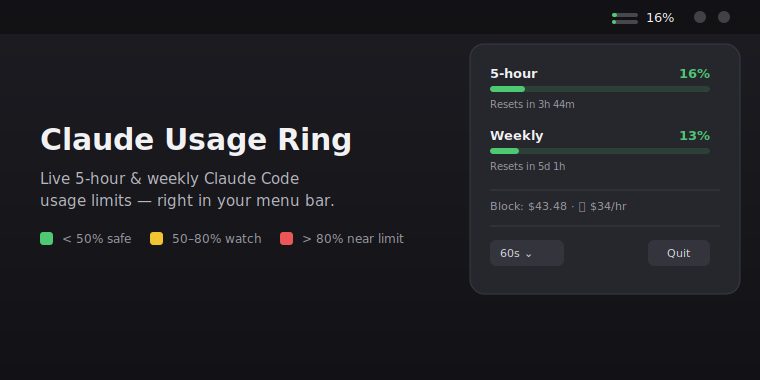

# Claude Usage Ring

**Live Claude Code usage limits in your macOS menu bar.** See your **5-hour
session** and **weekly** rate-limit usage at a glance — without running
`/usage` over and over.



<p>
  
  
  
</p>

---

## Why

Claude Code (Pro / Max / Team) enforces a rolling **5-hour** limit and a
**weekly** limit. The only built-in way to check them is the `/usage` command,
which you have to run manually. **Claude Usage Ring** keeps both numbers live in
your menu bar so you always know how close you are — and exactly when each
window resets.

## Features

- 📊 **Two mini-bars in the menu bar** — top = 5-hour, bottom = weekly.
- 🟢🟡🔴 **Color-coded** — green `< 50%`, yellow `50–80%`, red `> 80%`.
- ⏱️ **Reset countdowns** — "Resets in 3h 44m" / "Resets in 5d 1h".
- 💸 **Optional spend line** — active block cost + burn rate via
  [ccusage](https://github.com/ryoppippi/ccusage), if installed.
- 🪶 **Tiny & native** — SwiftUI `MenuBarExtra`, no Dock icon, polls every 60s
  with automatic back-off on rate limits.
- 🔒 **Local only** — reads your existing Claude session token on your machine
  and talks directly to Anthropic. Nothing is sent anywhere else.

## Install (prebuilt)

1. Download `ClaudeUsageRing.app.zip` from the
   [latest release](../../releases/latest) and unzip it (e.g. into
   `/Applications`).
2. The app is not notarized, so macOS Gatekeeper blocks it on first launch.
   Clear the quarantine flag and open it:
   ```bash
   xattr -dr com.apple.quarantine /Applications/ClaudeUsageRing.app
   open /Applications/ClaudeUsageRing.app
   ```
   (Or: right-click the app in Finder → **Open** → **Open**.)
3. Two mini-bars appear in your menu bar. macOS may ask once for Keychain
   access — click **Allow**.

> **Requires** macOS 14+ and a **signed-in Claude Code** on the same machine.
> The app reuses Claude Code's local session; it never asks you to log in.

## How it works

The app reads Claude Code's local OAuth access token (first the macOS Keychain
item `Claude Code-credentials`, then `~/.claude/.credentials.json`) and calls
`GET https://api.anthropic.com/api/oauth/usage` — the same endpoint that powers
the `/usage` panel.

- The token is read **only on your machine** and sent **only** to Anthropic.
- This endpoint is **undocumented**. If a Claude Code update changes the
  response schema, update the field lists in `UsageParser`.
- Utilization is reported on a 0–100 scale; the app reads the authoritative
  `limits` array and falls back to the `five_hour` / `seven_day` objects.

## Privacy & trust

This app touches your Claude session token, so here's exactly what happens —
and why you can verify it yourself:

- **The token never leaves your machine except to Anthropic.** It's sent only in
  the `Authorization` header to `api.anthropic.com`, the same as Claude Code.
  There is no analytics, no telemetry, no other network call. Read the entire
  networking layer: [`UsageClient.swift`](Sources/ClaudeUsageRingCore/Services/UsageClient.swift)
  and [`TokenReader.swift`](Sources/ClaudeUsageRingCore/Services/TokenReader.swift).
- **Why the Keychain prompt?** macOS asks because the app reads the
  `Claude Code-credentials` item that Claude Code created. Click **Allow** (or
  **Always Allow** to silence it). This is macOS protecting your token — exactly
  what you'd want. Signed & notarized release builds show a verified identity in
  this prompt and pass Gatekeeper without warnings.
- **Open source, build it yourself.** If you'd rather not trust a download, the
  [build-from-source](#build-from-source) path is two commands.

## Build from source

```bash
git clone https://github.com/acarmucahit/claude-usage-ring.git
cd claude-usage-ring
./build-app.sh            # produces ClaudeUsageRing.app (release)
open ClaudeUsageRing.app
```

Run with console logs:
```bash
./ClaudeUsageRing.app/Contents/MacOS/ClaudeUsageRing
```

## Development

```bash
swift test     # unit tests
swift build    # compile
```

Architecture: a testable `ClaudeUsageRingCore` library (models, services,
store, views) plus a thin `ClaudeUsageRing` executable (`@main` +
`MenuBarExtra`). The menu-bar icon is drawn as an `NSImage` because SwiftUI
`Canvas` does not render reliably inside a menu-bar label.

## FAQ

**Is this official?** No — it's an unofficial community tool, not affiliated
with Anthropic.

**Does it store or upload my token?** No. The token stays on your machine and
is sent only to Anthropic's API, exactly like Claude Code itself.

**The bars are grey / "Unexpected response format"?** The endpoint schema may
have changed; please open an issue with the (redacted) response shape.

## License

[MIT](LICENSE)

---

*Keywords: Claude Code usage monitor, Anthropic rate limit tracker, Claude Max
usage, 5-hour limit, weekly limit, macOS menu bar app, SwiftUI menubar, Claude
quota, ccusage.*
