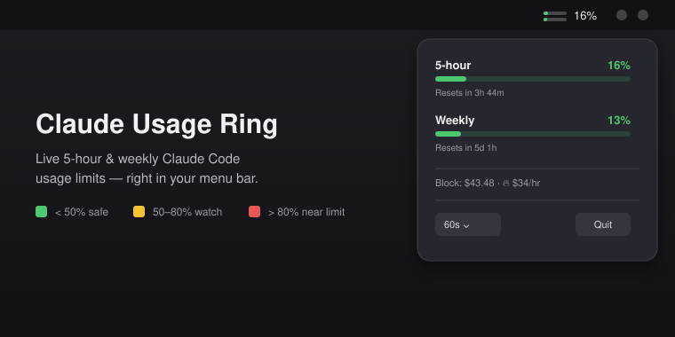

# Claude Usage Ring

**Live Claude Code usage limits in your macOS menu bar.** See your **5-hour
session** and **weekly** rate-limit usage at a glance — without running
`/usage` over and over.



<p>
  
  
  
</p>

---

## Why

Claude Code (Pro / Max / Team) enforces a rolling **5-hour** limit and a
**weekly** limit. The only built-in way to check them is the `/usage` command,
which you have to run manually. **Claude Usage Ring** keeps both numbers live in
your menu bar so you always know how close you are — and exactly when each
window resets.

## Features

- 📊 **Two mini-bars in the menu bar** — top = 5-hour, bottom = weekly.
- 🟢🟡🔴 **Color-coded** — green `< 50%`, yellow `50–80%`, red `> 80%`.
- ⏱️ **Reset countdowns** — "Resets in 3h 44m" / "Resets in 5d 1h".
- 💸 **Optional spend line** — active block cost + burn rate via
  [ccusage](https://github.com/ryoppippi/ccusage), if installed.
- 🪶 **Tiny & native** — SwiftUI `MenuBarExtra`, no Dock icon, polls every
  5 minutes with automatic back-off on rate limits, and refreshes on wake.
- 🩶 **Honest when stale** — if updates stop (Claude Code signed out, rate
  limited, offline), the bars turn grey and the menu shows when it last updated.
- 🚀 **Starts at login** — turned on automatically the first time you open it.
- 🔒 **Local only** — reads your existing Claude session token on your machine
  and talks directly to Anthropic. Nothing is sent anywhere else.

## Install (prebuilt)

1. Download `ClaudeUsageRing.app.zip` from the
   [latest release](../../releases/latest) and unzip it (e.g. into
   `/Applications`).
2. The app is not notarized, so macOS Gatekeeper blocks it on first launch.
   Clear the quarantine flag and open it:
   ```bash
   xattr -dr com.apple.quarantine /Applications/ClaudeUsageRing.app
   open /Applications/ClaudeUsageRing.app
   ```
   (Or open it once, then allow it under System Settings → Privacy & Security
   → **Open Anyway**.)
3. Two mini-bars and the 5-hour % appear in your menu bar. There is no Keychain
   dialog to answer.

> **Requires** macOS 14+ on Apple Silicon and a **signed-in Claude Code** on the
> same machine. The app reuses Claude Code's local session; it never asks you to
> log in.

## How it works

The app reads Claude Code's local OAuth access token (first the macOS Keychain
item `Claude Code-credentials`, then `~/.claude/.credentials.json`) and calls
`GET https://api.anthropic.com/api/oauth/usage` — the same endpoint that powers
the `/usage` panel.

- The Keychain item is read with Apple's `/usr/bin/security` tool — the same way
  Claude Code itself reads it. Claude Code writes the item with that tool, so
  macOS already trusts it for this item and shows no dialog. (Reading the item
  directly from the app made macOS ask for your password again every time
  Claude Code refreshed its token.)
- The app never refreshes or writes the token. If Claude Code's token has
  expired, the app shows the last values greyed out with "open Claude Code to
  resume" until Claude Code refreshes it.

- The token is read **only on your machine** and sent **only** to Anthropic.
- This endpoint is **undocumented**. If a Claude Code update changes the
  response schema, update the field lists in `UsageParser`.
- Utilization is reported on a 0–100 scale; the app reads the authoritative
  `limits` array and falls back to the `five_hour` / `seven_day` objects.

## Privacy & trust

This app touches your Claude session token, so here's exactly what happens —
and why you can verify it yourself:

- **The token never leaves your machine except to Anthropic.** It's sent only in
  the `Authorization` header to `api.anthropic.com`, the same as Claude Code.
  There is no analytics, no telemetry, no other network call. Read the entire
  networking layer: [`UsageClient.swift`](Sources/ClaudeUsageRingCore/Services/UsageClient.swift)
  and [`TokenReader.swift`](Sources/ClaudeUsageRingCore/Services/TokenReader.swift).
- **Why is there no Keychain prompt?** The token is read through Apple's
  `security` tool, which macOS already allows to read this item because Claude
  Code stores it with that tool. The app gets the same access Claude Code has —
  nothing more — and only reads that one item.
- **Open source, build it yourself.** If you'd rather not trust a download, the
  [build-from-source](#build-from-source) path is two commands.

## Build from source

```bash
git clone https://github.com/acarmucahit/claude-usage-ring.git
cd claude-usage-ring
./build-app.sh            # produces ClaudeUsageRing.app (release)
open ClaudeUsageRing.app
```

Check the data path from Terminal (one fetch, prints the numbers, exits):
```bash
./ClaudeUsageRing.app/Contents/MacOS/ClaudeUsageRing --check
```

## Development

```bash
swift test     # unit tests
swift build    # compile
```

Architecture: a testable `ClaudeUsageRingCore` library (models, services,
store, views) plus a thin `ClaudeUsageRing` executable (`@main` +
`MenuBarExtra`). The menu-bar icon is drawn as an `NSImage` because SwiftUI
`Canvas` does not render reliably inside a menu-bar label.

## FAQ

**Is this official?** No — it's an unofficial community tool, not affiliated
with Anthropic.

**Does it store or upload my token?** No. The token stays on your machine and
is sent only to Anthropic's API, exactly like Claude Code itself.

**The bars are grey?** The numbers are older than 15 minutes. Open the menu to
see why — usually Claude Code's sign-in expired (open Claude Code once) or
Anthropic is rate limiting the usage endpoint (the app backs off by itself).
`ClaudeUsageRing --check` prints the current values or the error.

**"Unexpected response format"?** The endpoint schema may have changed; please
open an issue with the (redacted) response shape.

## License

[MIT](LICENSE)

---

*Keywords: Claude Code usage monitor, Anthropic rate limit tracker, Claude Max
usage, 5-hour limit, weekly limit, macOS menu bar app, SwiftUI menubar, Claude
quota, ccusage.*
